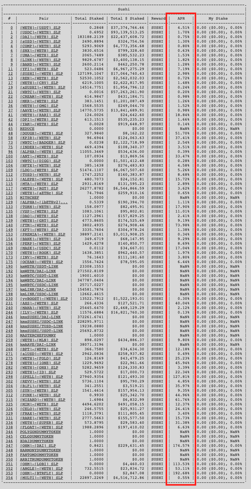

# GBV Backend Coding Task
Create a simple script for retrieving the yearly APR of [USDC-WETH pool on Sushiswap](https://analytics.sushi.com/pairs/0x397ff1542f962076d0bfe58ea045ffa2d347aca0).

You may want to check out [vfat-tools](https://vfat.tools/) and their implemention [`vfat-tools/src/static/js/aurora_auroraswap.js`](https://github.com/vfat-tools/vfat-tools/blob/master/src/static/js/aurora_auroraswap.js) for a brief idea.

The following materials might be useful:
1. [Uniswap V2 Documentation](https://docs.uniswap.org/protocol/V2/introduction)
2. [web3.js](https://web3js.readthedocs.io/en/v1.7.3/) / [web3.py](https://web3py.readthedocs.io/en/stable/)